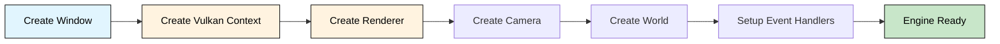
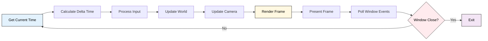
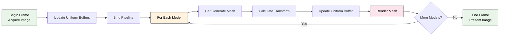
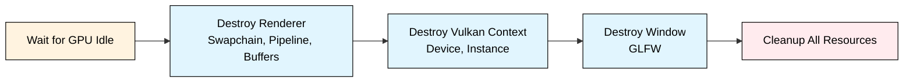

# Архитектура Воксельного Движка на Vulkan

## Обзор

Воксельный движок построен на модульной архитектуре с четким разделением ответственности между компонентами. Использует современный C++17 и Vulkan API для высокопроизводительного рендеринга.

## Основные компоненты

### 1. Engine (engine.h/cpp)

- **Назначение**: Главный координатор всех подсистем
- **Ответственность**:
  - Инициализация всех подсистем
  - Главный игровой цикл
  - Управление временем и обновлениями

### 2. Window (window.h/cpp)

- **Назначение**: Управление окном и GLFW
- **Ответственность**:
  - Создание и управление окном
  - Обработка событий ввода
  - Создание Vulkan surface
  - Получение расширений для Vulkan

### 3. Vulkan Context (vulkan_context.h/cpp)

- **Назначение**: Инициализация и управление Vulkan
- **Ответственность**:
  - Создание Vulkan instance
  - Выбор физического устройства
  - Создание логического устройства
  - Управление очередями команд
  - Создание command pool

### 4. Renderer (renderer.h/cpp)

- **Назначение**: Главный рендерер
- **Ответственность**:
  - Создание swapchain
  - Управление render pass
  - Создание graphics pipeline
  - Рендеринг кадров
  - Синхронизация GPU/CPU

### 5. Camera (camera.h/cpp)

- **Назначение**: Система камеры
- **Ответственность**:
  - Управление позицией и ориентацией
  - Генерация матриц view и projection
  - Обработка пользовательского ввода

### 6. World (world.h/cpp)

- **Назначение**: Представление игрового мира
- **Ответственность**:
  - Хранение воксельных моделей
  - Управление позициями объектов
  - Предоставление данных для рендеринга

### 7. Model (model.h/cpp)

- **Назначение**: Воксельная модель
- **Ответственность**:
  - Хранение 3D массива вокселей
  - Операции с вокселями (установка/получение)

### 8. Mesh (mesh.h/cpp)

- **Назначение**: Геометрическое представление для GPU
- **Ответственность**:
  - Хранение вершин и индексов
  - Управление GPU буферами
  - Привязка к command buffer
  - Генерация мешей из воксельных моделей

### 9. Buffer (buffer.h/cpp)

- **Назначение**: Управление Vulkan буферами
- **Ответственность**:
  - Создание различных типов буферов
  - Копирование данных в GPU память
  - Специализированные классы для vertex/index/uniform буферов

### 10. Shader (shader.h/cpp)

- **Назначение**: Управление шейдерами
- **Ответственность**:
  - Загрузка SPIR-V шейдеров
  - Создание shader modules
  - Управление шейдерными этапами

## Рендер Пайплайн

### Поток данных

```text
Voxel Model → Mesh Generator → Vertices + Indices → GPU Buffers → Vulkan Pipeline → Framebuffer
```

### Этапы рендеринга

1. **Begin Frame**: Получение изображения из swapchain
2. **Update Uniforms**: Обновление матриц и параметров освещения
3. **Bind Pipeline**: Привязка graphics pipeline
4. **Render World**:
   - Для каждой модели в мире:
     - Генерация или получение меша
     - Обновление model матрицы
     - Рендеринг меша
5. **End Frame**: Презентация кадра

### Графический конвейер Vulkan

```text
Vertex Input → Vertex Shader → Primitive Assembly → Rasterization → Fragment Shader → Color Blending → Framebuffer
```

## Шейдеры

### Vertex Shader (voxel.vert)

- **Входные данные**: Position, Normal, Color (упакованный)
- **Uniform данные**: Model/View/Projection матрицы, позиция камеры, параметры освещения
- **Выходные данные**: Трансформированная позиция, мировая позиция, нормаль, цвет
- **Функции**: Трансформация вершин, распаковка цветов, передача данных освещения

### Fragment Shader (voxel.frag)

- **Входные данные**: Позиция фрагмента, нормаль, цвет
- **Освещение**: Модель Фонга (ambient + diffuse + specular)
- **Эффекты**: Туман на основе расстояния
- **Выходные данные**: Финальный цвет пикселя

## Типы данных

### Vertex Structure

```cpp
struct vertex {
    vec3f position;  // 12 bytes
    vec3f normal;    // 12 bytes
    uint32 color;    // 4 bytes (RGBA packed)
}; // Total: 28 bytes
```

### Uniform Buffer Object

```cpp
struct uniform_buffer_object {
    mat4 model;      // 64 bytes
    mat4 view;       // 64 bytes
    mat4 projection; // 64 bytes
    vec3f view_pos;  // 12 bytes + 4 padding
    vec3f light_pos; // 12 bytes + 4 padding
    vec3f light_color; // 12 bytes + 4 padding
}; // Total: 240 bytes
```

## Инициализация и жизненный цикл

### Инициализация движка



### Главный игровой цикл



### Рендер кадра



### Очистка ресурсов



## Зависимости и требования

### Зависимости

- **Vulkan SDK** 1.3+
- **GLFW** 3.3+
- **GLM** (для математики)
- **C++17** компилятор

### Поддерживаемые платформы

- Windows (Visual Studio)
- Linux (GCC/Clang)
- macOS (через MoltenVK)

## Использование

```cpp
#include "engine.h"

int main() {
    voxel::engine engine(1280, 720, "Voxel World");

    // Создать простую модель
    voxel::model model(4, 4, 4);
    model.set_voxel(1, 1, 1, 0xFF0000FF); // Красный воксель

    // Добавить в мир
    engine.get_world().add_model(model, {0, 0, 0});

    // Запустить движок
    engine.run();

    return 0;
}
```

## Сборка

```bash
mkdir build && cd build
cmake ..
make
```

## Расширения и будущие улучшения

### Приоритетные улучшения

1. **Chunk System**: Разделение мира на чанки для эффективного LOD
2. **Instanced Rendering**: Для множественных копий объектов
3. **Compute Shaders**: Для процедурной генерации и физики
4. **Texture Atlas**: Поддержка текстур вместо одиночных цветов
5. **Shadow Mapping**: Реалистичные тени

### Оптимизации

1. **Face Culling**: Не генерируем грани, которые скрыты соседними вокселями
2. **Frustum Culling**: Отсекаем объекты вне видимой области
3. **Memory Management**:
   - Использование staging buffers для эффективного копирования данных
   - Переиспользование command buffers
   - Упакованные цвета (32-bit) для экономии памяти
4. **Батчинг**: Группировка схожих моделей для снижения количества draw calls

### Долгосрочные цели

1. **Deferred Rendering**: Для сложного освещения
2. **Global Illumination**: Реалистичное освещение
3. **Multithreading**: Параллельная генерация мешей и обновление мира
4. **Editor Tools**: Инструменты редактирования
5. **Pool алокаторы**: Для частых аллокаций ресурсов
