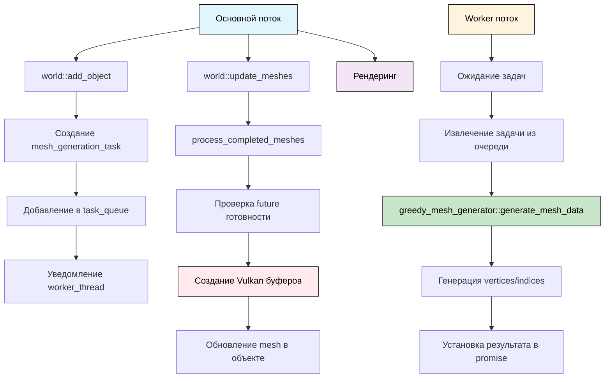

# Архитектура класса World

## Обзор

Класс `world` представляет собой центральный компонент для управления объектами в воксельном мире. Новая архитектура обеспечивает:

- **Полные трансформации** - поддержка перемещения, поворота и масштабирования
- **Кэширование мешей** - автоматическая генерация и кэширование мешей из воксельных моделей
- **Связь с пользовательским кодом** - система событий и уникальные идентификаторы объектов
- **Оптимизация производительности** - ленивое обновление мешей и кэширование матриц

## Основные компоненты

### 1. Структура `transform` (`transform.h`)

Хранит трансформацию объекта с кэшированием матрицы:

```cpp
struct transform {
    vec3f position{0.0f, 0.0f, 0.0f};     // Позиция
    vec3f rotation{0.0f, 0.0f, 0.0f};     // Углы поворота в радианах
    vec3f scale{1.0f, 1.0f, 1.0f};        // Масштаб
    
    mutable mat4f cached_matrix;           // Кэшированная матрица
    mutable bool matrix_dirty = true;      // Флаг необходимости пересчета
    
    const mat4f& get_matrix() const;       // Получить матрицу (с кэшированием)
    
    // Методы изменения трансформации
    void set_position(const vec3f& pos);
    void set_rotation(const vec3f& rot);
    void set_scale(const vec3f& scl);
    void translate(const vec3f& offset);
    void rotate(const vec3f& angles);
    void scale(const vec3f& factor);
};
```

### 2. Структура `world_object` (`world.h`)

Представляет объект в мире:

```cpp
struct world_object {
    uint32 id;                             // Уникальный идентификатор
    std::string name;                      // Имя объекта
    model model;                           // Воксельная модель
    transform transform;                   // Трансформация
    std::shared_ptr<mesh> mesh;            // Кэшированный меш
    bool mesh_dirty = true;                // Флаг необходимости пересоздания меша
    bool visible = true;                   // Видимость
    uint32 layer = 0;                      // Слой объекта
};
```

### 3. Система событий (`world.h`)

Уведомления об изменениях в мире:

```cpp
enum class world_event_type {
    object_added,
    object_removed,
    object_transformed,
    object_model_changed,
    object_visibility_changed
};

struct world_event {
    world_event_type type;
    uint32 object_id;
    const world_object* object;
};

using world_event_callback = std::function<void(const world_event&)>;
```

## Структура файлов

```
engine/
├── include/
│   ├── transform.h      # Структура transform
│   ├── world.h          # Класс world и world_object
│   ├── math_utils.h     # Математические функции для матриц
│   └── ...
└── src/
    ├── transform.cpp    # Реализация transform
    ├── world.cpp        # Реализация world
    ├── math_utils.cpp   # Реализация математических функций
    └── ...
```

## Основные возможности

### Управление объектами

```cpp
// Создание модели (один раз)
auto cube_model = std::make_shared<voxel::model>(10, 10, 10);
cube_model->fill(voxel::voxel{0xFF0000FF}); // Красный куб

// Добавление объектов (модель используется по ссылке)
uint32 object_id = world.add_object(cube_model, position);

// Удаление объекта
world.remove_object(object_id);

// Проверка существования
if (world.object_exists(object_id)) {
    // ...
}
```

### Трансформации

```cpp
// Установка трансформации
world.set_object_position(object_id, vec3f(10.0f, 5.0f, 0.0f));
world.set_object_rotation(object_id, vec3f(0.0f, math::radians(45.0f), 0.0f));
world.set_object_scale(object_id, vec3f(2.0f, 2.0f, 2.0f));

// Относительные трансформации
world.translate_object(object_id, vec3f(1.0f, 0.0f, 0.0f));
world.rotate_object(object_id, vec3f(0.0f, math::radians(10.0f), 0.0f));
world.scale_object(object_id, vec3f(1.1f, 1.1f, 1.1f));
```

### Работа с моделями

```cpp
// Изменение модели объекта
auto new_model = std::make_shared<voxel::model>(5, 5, 5);
new_model->fill(voxel::voxel{0x00FF00FF}); // Зеленый куб
world.set_object_model(object_id, new_model);

// Получение модели
auto obj_model = world.get_object_model(object_id);
if (obj_model) {
    // Работа с моделью
    uint32 width = obj_model->get_width();
}
```

### Видимость

```cpp
// Управление видимостью
world.set_object_visible(object_id, false);
bool is_visible = world.is_object_visible(object_id);
```

### Рендеринг

```cpp
// Обновление мешей (вызывается перед рендерингом)
world.update_meshes();

// Получение объектов для рендеринга
const auto& objects = world.get_renderable_objects();
for (const auto& obj : objects) {
    if (obj->visible && obj->mesh) {
        // Рендеринг объекта с трансформацией
        const mat4f& transform_matrix = obj->transform.get_matrix();
        obj->mesh->draw(command_buffer);
    }
}
```

## Оптимизации

### 1. Асинхронная генерация мешей

Генерация мешей происходит в отдельном потоке для предотвращения блокировки основного потока:

```cpp
// Создание мира (автоматически запускает рабочий поток)
auto world = std::make_unique<voxel::world>(vulkan_context);

// Создание модели (один раз)
auto cube_model = std::make_shared<voxel::model>(10, 10, 10);
cube_model->fill(voxel::voxel{0xFF0000FF});

// Добавление объекта (меш генерируется асинхронно)
uint32 object_id = world->add_object(cube_model, position);

// Обновление мешей (проверяет завершенные задачи)
world->update_meshes();
```

**Преимущества:**
- **Неблокирующий основной поток** - рендеринг продолжается во время генерации мешей
- **Автоматическая отмена** - если объект удаляется, его задача отменяется
- **Масштабируемость** - легко добавить пул потоков для параллельной генерации
- **Простой API** - все методы работают с `shared_ptr<model>`

### 2. Переиспользование моделей

Использование `shared_ptr<model>` предотвращает дублирование данных:

```cpp
// Создаем модель один раз
auto cube_model = std::make_shared<voxel::model>(10, 10, 10);
cube_model->fill(voxel::voxel{0xFF0000FF});

// Используем одну модель для множества объектов
uint32 obj1 = world.add_object(cube_model, vec3f(0, 0, 0));
uint32 obj2 = world.add_object(cube_model, vec3f(20, 0, 0));
uint32 obj3 = world.add_object(cube_model, vec3f(40, 0, 0));
// Все объекты используют одну и ту же модель в памяти
```

### 3. Кэширование матриц трансформации

Матрицы пересчитываются только при изменении трансформации:

```cpp
const mat4f& transform::get_matrix() const {
    if (matrix_dirty) {
        cached_matrix = math::transform_matrix(position, rotation, scale);
        matrix_dirty = false;
    }
    return cached_matrix;
}
```

### 4. Ленивое обновление мешей

Меши пересоздаются только при изменении модели:

```cpp
void world::update_meshes() {
    for (auto& obj : objects_) {
        if (obj->mesh_dirty) {
            update_object_mesh(obj.get());
        }
    }
}
```

### 5. Безопасный быстрый поиск объектов

Использование `weak_ptr` в `unordered_map` предотвращает висячие указатели:

```cpp
world_object* world::get_object(uint32 object_id) {
    auto it = object_map_.find(object_id);
    if (it != object_map_.end()) {
        auto shared_obj = it->second.lock();
        return shared_obj ? shared_obj.get() : nullptr;
    }
    return nullptr;
}
```

## Дополнительные возможности

### 1. Пространственное разделение

Для больших миров можно добавить:
- **Octree** - для 3D пространства
- **Quadtree** - для 2D проекций
- **Spatial hashing** - для равномерного распределения

### 2. LOD система

Для оптимизации рендеринга:
- Разные уровни детализации для разных расстояний
- Автоматическое переключение LOD
- Кэширование мешей для каждого LOD

### 3. Система групп

Для организации объектов:
- Группировка по типам
- Иерархические структуры
- Массовые операции над группами

### 4. Система физики

Для интерактивности:
- Коллизии между объектами
- Физические свойства объектов
- Симуляция движения

## Пример использования

```cpp
// Создание мира
auto world = std::make_unique<voxel::world>(vulkan_context);

// Создание модели (один раз, используется для нескольких объектов)
auto cube_model = std::make_shared<voxel::model>(10, 10, 10);
cube_model->fill(voxel::voxel{0xFF0000FF}); // Красный куб

// Добавление объектов (модель используется по ссылке)
uint32 cube1 = world->add_object(cube_model, vec3f(0, 0, 0));
uint32 cube2 = world->add_object(cube_model, vec3f(20, 0, 0));

// Анимация
world->rotate_object(cube1, vec3f(0, math::radians(1.0f), 0));
world->translate_object(cube2, vec3f(0, 0.1f, 0));

// Обновление и рендеринг
world->update_meshes();
for (const auto& obj : world->get_renderable_objects()) {
    if (obj->visible && obj->mesh) {
        // Рендеринг с трансформацией
        renderer.draw_mesh(obj->mesh, obj->transform.get_matrix());
    }
}
```

## Преимущества новой архитектуры

1. **Производительность** - кэширование и ленивые вычисления
2. **Гибкость** - полные трансформации объектов
3. **Масштабируемость** - поддержка большого количества объектов
4. **Удобство использования** - простой API для управления объектами
5. **Расширяемость** - легко добавлять новые возможности
6. **Модульность** - разделение на логические компоненты (transform.h, world.h)
7. **Эффективность памяти** - использование shared_ptr для моделей предотвращает дублирование данных
8. **Переиспользование ресурсов** - одна модель может использоваться множеством объектов
9. **Безопасность указателей** - использование weak_ptr предотвращает висячие указатели
10. **Асинхронность** - генерация данных мешей в отдельном потоке не блокирует рендеринг
11. **Потокобезопасность Vulkan** - создание буферов только в основном потоке
12. **Простой API** - все методы работают с `shared_ptr<model>`, нет дублирования интерфейсов

## Архитектура асинхронной генерации мешей



### Потоки выполнения:

1. **Основной поток** - рендеринг, управление объектами, создание Vulkan буферов
2. **Worker поток** - генерация данных вершин и индексов (CPU-интенсивная работа)

### Разделение ответственности:

- **CPU часть** (Worker поток): генерация `mesh_data` (vertices + indices)
- **GPU часть** (Основной поток): создание Vulkan буферов из `mesh_data`

### Синхронизация:

- **task_queue** - защищена мьютексом
- **condition_variable** - уведомляет worker поток о новых задачах
- **future/promise** - передача `mesh_data` между потоками 